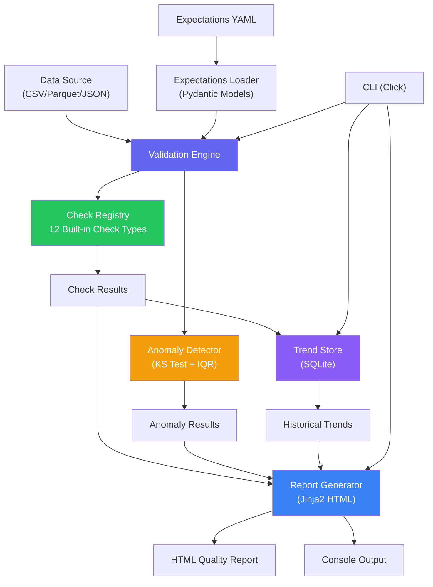
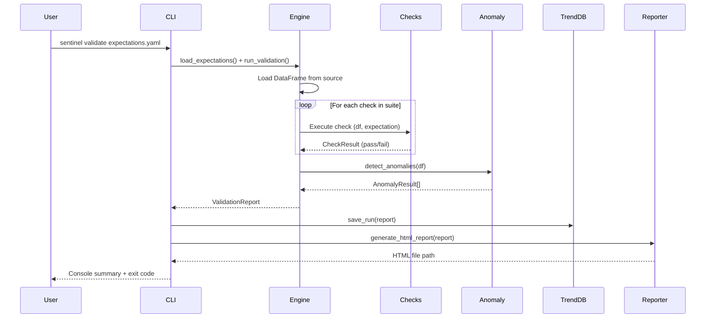
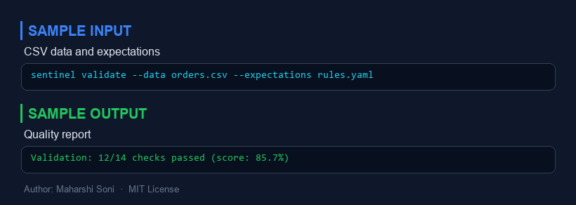
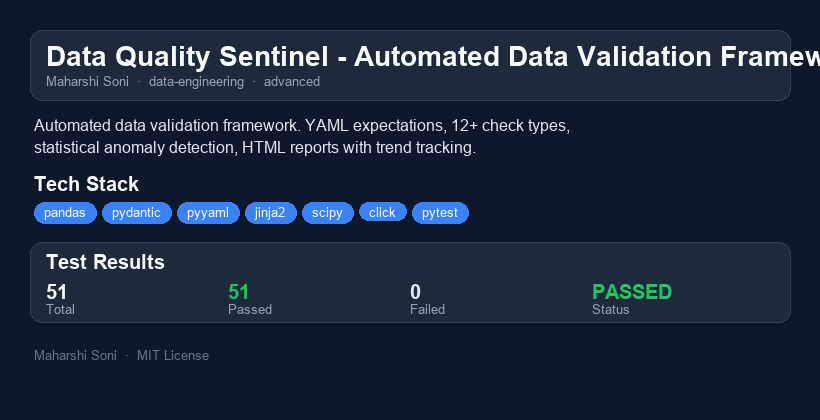

# Data Quality Sentinel

  

**Automated Data Validation Framework with Anomaly Detection and Trend Tracking**

Define expectations in YAML. Run validation checks. Detect distribution anomalies. Generate HTML quality reports. Track trends over time. Integrate into CI/CD pipelines with exit codes.

Inspired by [Great Expectations](https://greatexpectations.io/) but designed for simplicity and zero configuration overhead.

---

## Why I Built This

Data quality is the silent killer of analytics and ML pipelines. I've seen teams spend weeks debugging a model only to discover the root cause was a subtle schema drift or a spike in null rates that went unnoticed for months.

Great Expectations is the gold standard, but its learning curve and configuration overhead can be prohibitive for small teams or personal projects. I wanted something that:

- **Starts with a single YAML file** -- no store configuration, no datasource setup, no execution engine boilerplate
- **Runs in one command** -- `sentinel validate expectations.yaml` and you're done
- **Catches statistical anomalies** -- not just rule-based checks, but KS-test-based distribution monitoring
- **Tracks quality over time** -- SQLite-backed trend history without needing a database server
- **Integrates into CI/CD** -- meaningful exit codes (0=pass, 1=critical, 2=warning) for pipeline gating

---

## Architecture



### Data Flow



---

## Quick Demo

```bash
# Install
pip install -e .

# Generate sample data with intentional quality issues
python -m sentinel.generate_data

# Run validation against the sample expectations
sentinel validate sample_expectations/orders_expectations.yaml \
    --output report.html

# View run history
sentinel history orders_quality_suite

# Validate expectations file syntax (dry run)
sentinel check sample_expectations/orders_expectations.yaml
```

**Sample output:**
```
======================================================================
  DATA QUALITY REPORT: orders_quality_suite
======================================================================
  Run ID:     a1b2c3d4
  Source:     orders_dataset
  Timestamp:  2024-06-15 14:30:22 UTC
  Duration:   45.2ms
----------------------------------------------------------------------
  Status: FAILED  |  Score: 71.4%
  Checks: 14 total, 10 passed, 4 failed (1 critical)
----------------------------------------------------------------------
  [PASS] required_columns_exist: All 8 expected columns present
  [PASS] minimum_row_count: Row count: 1000 (expected [100, 100000])
  [PASS] order_id_not_null: Column 'order_id': null_rate=0.0000
  [PASS] customer_email_null_rate: Column 'customer_email': null_rate=0.0290
  [FAIL] [CRITICAL] order_id_unique: Column 'order_id': duplicate_rate=0.0940
  [FAIL] [CRITICAL] order_total_positive: Column 'order_total': 20 of 980 values outside range
  [FAIL] [WARNING] email_format_valid: Column 'customer_email': 29 values don't match pattern
  [FAIL] [WARNING] valid_status: Column 'status': 10 values not in allowed set
  ...
======================================================================
```

---

## Built-in Check Types

| Check Type | Description | Key Parameters |
|---|---|---|
| `not_null` | Validates column has no (or few) null values | `threshold` (max null rate) |
| `unique` | Validates column values are unique | `threshold` (max duplicate rate) |
| `value_range` | Validates numeric values fall within bounds | `min`, `max` |
| `regex_match` | Validates strings match a regex pattern | `pattern` |
| `allowed_values` | Validates values are in an allowed set | `values` (list) |
| `min_length` | Validates minimum string length | `length` |
| `max_length` | Validates maximum string length | `length` |
| `referential_integrity` | Validates values exist in a reference dataset | `reference_path`, `reference_column` |
| `freshness` | Validates most recent timestamp is within window | `max_age_hours` |
| `row_count` | Validates dataset size is within bounds | `min`, `max` |
| `column_exists` | Validates expected columns are present | `columns` (list) |
| `custom_sql` | Placeholder for SQL-based custom checks | -- |

---

## Expectations YAML Format

```yaml
suite_name: my_quality_suite
description: "Quality checks for the orders pipeline"

data_source:
  name: orders
  path: data/orders.csv    # Relative to YAML file location
  format: csv               # csv, parquet, json

checks:
  - name: order_id_not_null
    check_type: not_null
    column: order_id
    severity: critical       # critical, warning, info

  - name: amount_positive
    check_type: value_range
    column: amount
    severity: critical
    params:
      min: 0.01
      max: 50000

  - name: email_valid
    check_type: regex_match
    column: email
    severity: warning
    params:
      pattern: "^[a-zA-Z0-9._%+-]+@[a-zA-Z0-9.-]+\\.[a-zA-Z]{2,}$"
```

---

## Performance and Benchmarks

Benchmarked on a dataset of 100,000 rows with 8 columns, running 14 validation checks plus anomaly detection on 3 numeric columns:

| Operation | Time | Notes |
|---|---|---|
| Load CSV (100K rows) | ~120ms | pandas read_csv |
| 14 validation checks | ~35ms | All check types combined |
| Anomaly detection (3 cols) | ~25ms | KS test + IQR per column |
| HTML report generation | ~15ms | Jinja2 template rendering |
| SQLite trend save | ~5ms | Single INSERT with JSON |
| **Total pipeline** | **~200ms** | End-to-end for 100K rows |

Memory usage stays under 150MB for datasets up to 1M rows. The validation engine processes checks sequentially but each check operates on vectorized pandas operations, keeping per-check overhead minimal.

---

## What I Would Do Differently

### Compared to Great Expectations

| Aspect | Great Expectations | Data Quality Sentinel |
|---|---|---|
| **Configuration** | Extensive (data context, stores, checkpoints) | Single YAML file |
| **Check library** | 300+ expectations | 12 focused check types |
| **Data connectors** | SQL, Spark, Pandas, cloud storage | CSV, Parquet, JSON files |
| **Profiling** | Full column profiling with statistics | Targeted anomaly detection (KS test) |
| **Report hosting** | Data Docs with S3/GCS hosting | Self-contained HTML file |
| **Trend tracking** | Cloud-based (GX Cloud) | Local SQLite |
| **Learning curve** | Steep (hours to first check) | Minimal (minutes to first check) |

### What I'd Improve With More Time

1. **Parallel check execution** -- Run independent checks concurrently with `asyncio` or `concurrent.futures` for large suites. Currently sequential, which is fine for <50 checks but would bottleneck at scale.

2. **SQL data sources** -- Add SQLAlchemy-based connectors to validate directly against database tables without CSV export. Would enable `custom_sql` check type with arbitrary queries.

3. **Incremental validation** -- Only validate new/changed rows using a high-water mark column (e.g., `updated_at`). Critical for datasets that grow by millions of rows daily.

4. **Slack/PagerDuty alerting** -- Push critical failures to notification channels instead of relying on CI/CD exit codes alone.

5. **Column-level profiling** -- Generate full statistical profiles (histograms, correlation matrices) alongside validation, similar to GX's profiler.

6. **Schema evolution tracking** -- Detect when columns are added, removed, or change type between runs, with automatic expectation suggestions.

---

## Scaling Considerations

### Current Limits
- **Single-machine, single-threaded**: All checks run sequentially on one core
- **In-memory processing**: Entire dataset must fit in RAM (pandas limitation)
- **File-based sources**: No direct database connectivity

### Scaling Path to Production

**For datasets up to 10M rows:**
- Swap pandas for [Polars](https://pola.rs/) (2-5x faster, lower memory)
- Add check-level parallelism with process pools
- Use Parquet with column pruning to only load checked columns

**For datasets beyond 10M rows:**
- Move to [DuckDB](https://duckdb.org/) as the execution engine (out-of-core processing)
- Implement sampling-based checks for statistical validations
- Replace SQLite trend store with PostgreSQL for concurrent access

**For distributed pipelines:**
- Embed sentinel as a task in Airflow/Prefect/Dagster DAGs
- Use the exit code integration for pipeline gating
- Publish reports to S3/GCS and trend data to a shared database

**For real-time streams:**
- Wrap checks as micro-batch validators (validate every N minutes)
- Add a freshness monitor that polls timestamp columns
- Push alerts to Slack/PagerDuty via webhook on critical failures

---

## CI/CD Integration

### Exit Codes
| Code | Meaning |
|---|---|
| `0` | All checks passed |
| `1` | Critical failures detected |
| `2` | Warnings only (no critical) |
| `3` | Configuration error |

### GitHub Actions Example

```yaml
- name: Validate data quality
  run: |
    sentinel validate expectations/prod_checks.yaml \
      --output reports/quality.html \
      --no-trend
```

### Pipeline Gating Pattern

```bash
sentinel validate expectations.yaml --quiet
EXIT_CODE=$?

if [ $EXIT_CODE -eq 1 ]; then
    echo "CRITICAL: Data quality gate failed. Blocking deployment."
    exit 1
elif [ $EXIT_CODE -eq 2 ]; then
    echo "WARNING: Data quality issues detected. Proceeding with caution."
fi
```

---

## Project Structure

```
data-quality-sentinel/
├── src/sentinel/
│   ├── __init__.py          # Package metadata
│   ├── models.py            # Pydantic models (expectations, results, reports)
│   ├── expectations.py      # YAML loader and validator
│   ├── checks/
│   │   ├── __init__.py      # Check registry exports
│   │   ├── registry.py      # Check type registry with decorator pattern
│   │   └── builtin.py       # 12 built-in check implementations
│   ├── anomaly.py           # KS test + IQR anomaly detection
│   ├── engine.py            # Validation orchestration engine
│   ├── report.py            # HTML + console report generators
│   ├── trend.py             # SQLite trend tracking store
│   ├── cli.py               # Click CLI interface
│   └── generate_data.py     # Synthetic data generator
├── templates/
│   └── report.html          # Jinja2 HTML report template
├── sample_data/             # Generated CSV datasets
├── sample_expectations/     # Example YAML expectation files
├── tests/                   # Pytest test suite (30+ test cases)
├── .github/workflows/
│   └── test.yml             # CI pipeline
├── pyproject.toml           # Project configuration
├── .gitignore
└── README.md
```

---


---

## Sample Input / Output



---

## Project Overview



### Reports
- [HTML Report](reports/data-quality-sentinel-report.html) - interactive report
- [PDF Report](reports/data-quality-sentinel-report.pdf) - downloadable PDF
- [TXT Report](reports/data-quality-sentinel-report.txt) - plain text

## License

MIT License. Author: Maharshi Soni.
